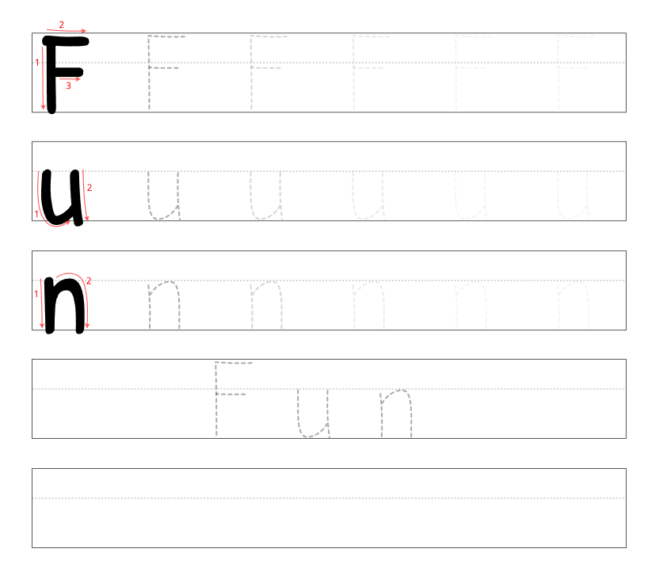

# Word Writing Lesson Generator ✏️

Traditional alphabet practice can often feel like a chore for toddlers. Many children are hesitant to learn their ABCs through repetitive rote memorization and find generic worksheets uninspiring.

**This tool was built on a simple insight:** Children are much more excited to write when the words mean something to them. Whether it’s their own name, their favorite animal, or a toy they love, writing words they have a personal interest in boosts their mood and turns "study time" into "play time."

## ✨ Features
- **Interest-Led Learning:** Type any word that excites your child to generate an instant, personalized lesson.
- **Stroke Order Guidance:** Every letter block includes visual cues and numbered arrows to help children master the correct writing sequence and direction.
- **Full Case Support:** Supports both uppercase and lowercase letters.
- **Multi-page Support:** Enter a list of favorite words (one per line) to create a custom workbook.
- **Smart Layout:** Choose between equal spacing or optimized spacing. The tool automatically protects letters with "tails" (g, j, p, q, y) so they never get cut off.
- **Vector Quality:** By hosting on GitHub Pages, this tool uses SVG injection to ensure your "Save as PDF" results are 100% sharp, professional-grade vectors. Avoid using Microsoft Print to PDF, as it produces raster output.

## 🚀 How to Use
1. Visit the live tool: [Word Writing Lesson Generator](https://andrematomer.github.io/word-writing-lesson-generator)
2. Type words your child loves in the text area (e.g., "Truck", "Dinosaur", "Pizza").
3. Choose your preferred block distribution.
4. Click **Print / Save as PDF**.

## ⚠️ Known Limitations
- **Desktop First:** This tool is designed for desktop browsers (Chrome, Edge, Firefox).
- **Mobile Support:** While the site is viewable on mobile, printing from iOS/Android often results in broken page breaks or scaling issues due to how mobile browsers handle print CSS. For the best experience, use a PC.
- **Characters:** Only supports A-Z (both cases). Numbers and punctuation are not currently supported.

## 📜 Credits
- **Letterforms:** Based on the [tracedletters](https://github.com/domsson/tracedletters) project.
- **Typography:** Lettering paths are based on the [Patrick Hand](https://fonts.google.com/specimen/Patrick+Hand) font, designed by **Patrick Wagesreiter**.
